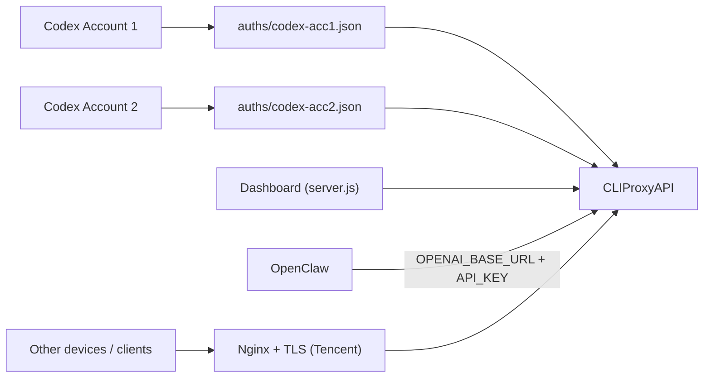

# CLIProxyAPI + OpenClaw 号池管理套件

把本地多 Codex 账号会话接入 `CLIProxyAPI`，并提供一个可视化控制台用于管理服务、账号会话、模型与日志。

## 二次优化说明

本仓库是基于上游项目的二次优化版本，当前重点放在：

- 控制台账号管理与验证能力增强
- OpenClaw 默认模型联动与可视化切换
- OpenClaw Gemini 服务商接入与 `/modes` 模型切换
- 路由命中、异常告警、失效账号排查
- 移动端 WebUI 适配与首屏卡片化
- README、截图、运维说明补全

## 更新日志（2026-03-28）

- 后端新增异步任务接口：`/api/tasks/usage-all`、`/api/tasks/verify-all`、`/api/tasks/:id`、`/api/tasks?status=...`
- 后端统一响应结构与错误码；`POST` 接口增加 schema 校验（`INVALID_INPUT` 等）
- 日志分析改为增量解析（offset + rotate/truncate 处理 + 缓存），告警中心只聚焦异常
- 用量语义改为“5小时剩余% / 每周剩余%”，并新增持久化缓存：`data/account-usage-cache.json`
- `/api/accounts` 会回填 usage 并返回 `stale`（TTL 6h），刷新页面不再丢失用量显示
- 新增失效账号清理接口：`POST /api/accounts/cleanup-invalid`（`dry-run|apply`）
- 总览精简为 4 张卡（服务状态、端口监听、模型数量、认证文件数量）
- 账号卡精简为邮箱/状态/最近命中/双剩余进度条；保留“一键验证全部账号”
- 移动端改为底部固定导航，顶部保留标题 + 状态 + 搜索，视觉风格调整为轻量苹果风
- 更新控制台截图：`docs/screenshots/dashboard-desktop.png`、`docs/screenshots/dashboard-mobile.png`

上游项目：

- 原作者仓库：[`ychenfen/openclaw-cliproxy-kit`](https://github.com/ychenfen/openclaw-cliproxy-kit)

当前仓库不是上游官方分支，属于面向个人运维场景的增强版整理。

本仓库已经包含两套可直接落地的一键部署方案：

- 本地一键部署（macOS/Linux 本机）
- 腾讯云一键部署（本地发起远程部署 + 服务器端安装）

## 截图

### 控制台（桌面）


### 控制台（移动端）


## 主要能力

- 双账号 Codex 会话同步：`sync_codex_auths.sh`
- CLIProxyAPI 本地代理管理
- Dashboard 可视化运维
- 账号导入、覆盖更新、启用/禁用、删除
- 单账号验证与一键验证全部账号
- 失效账号自动提取与重登入口
- 模型列表可视化切换，并同步 OpenClaw 默认模型
- 可配合 OpenClaw 增加独立 Gemini 服务商，在 TG `/modes` 中切换
- 异常告警聚合展示（error/warn/timeout/401/429/5xx）
- 移动端优先的 WebUI：首屏摘要卡片、底部快捷导航、折叠面板
- 可选兼容层：把旧式 `thinking`/`minimal` 请求改写为当前代理可接受的 `reasoning`
- 配置与日志脱敏展示
- 一键部署脚本（本地 + 腾讯云）
- 常见故障复盘与标准修复路径

## 架构



## 仓库结构

- `server.js` Dashboard 后端 API
- `web/` Dashboard 前端
- `sync_codex_auths.sh` 从 `CODEX_HOME/auth.json` 转换认证文件
- `scripts/minimal-compat-shim.js` 旧参数兼容层，可把请求转发到主代理
- `scripts/oneclick-local.sh` 本地一键部署
- `scripts/oneclick-tencent-remote.sh` 本地发起腾讯云远程部署
- `scripts/oneclick-tencent-server.sh` 腾讯云服务器端一键安装
- `config.example.yaml` CLIProxyAPI 示例配置
- `docs/oneclick-deploy.md` 部署与排障速查
- `skills/openclaw-telegram-bot-triage/SKILL.md` Telegram 机器人故障排障 Skill

## 环境要求

- `codex` CLI（已登录两个账号）
- `cliproxyapi` 二进制（本地或服务器可执行）
- `node >= 18`
- `npm`
- `jq`
- `curl`

腾讯云额外要求：

- Ubuntu 22.04+
- `systemd`
- 可选：`nginx`
- 可选：`certbot`（启用 TLS 时）

## 本地一键部署

### 1) 准备两个账号登录

```bash
CODEX_HOME=~/.codex-acc1 codex login
CODEX_HOME=~/.codex-acc2 codex login
```

### 2) 执行一键脚本

```bash
bash scripts/oneclick-local.sh
```

成功后默认地址：

- Dashboard：`http://127.0.0.1:8328`
- Proxy：`http://127.0.0.1:8317/v1`
- Compat Shim（可选）：`http://127.0.0.1:8318/v1`

### 3) 常用覆盖参数

```bash
CODEX_ACC1_HOME="$HOME/.codex-acc1" \
CODEX_ACC2_HOME="$HOME/.codex-acc2" \
CLIPROXY_PORT=18317 \
DASHBOARD_PORT=18328 \
CLIPROXY_API_KEY="replace-with-strong-key" \
bash scripts/oneclick-local.sh
```

## 腾讯云一键部署（推荐从本地发起）

### 本地发起远程部署

```bash
REMOTE_HOST="81.70.32.11" \
REMOTE_USER="ubuntu" \
SSH_KEY_PATH="$HOME/.ssh/id_rsa" \
DOMAIN="api.yuchenxu.cn" \
ENABLE_TLS=1 \
CERTBOT_EMAIL="you@example.com" \
bash scripts/oneclick-tencent-remote.sh
```

此流程会自动完成：

- 同步本地双账号 auth 文件
- 上传 `cliproxyapi-linux-amd64`
- 远端安装 systemd 服务 `cliproxyapi`
- 可选配置 `nginx` 反代和 TLS 证书

### 在服务器直接执行

```bash
CLIPROXY_API_KEY="replace-with-strong-key" \
CLIPROXY_PORT=15900 \
DOMAIN="api.your-domain.com" \
ENABLE_NGINX=1 \
ENABLE_TLS=1 \
CERTBOT_EMAIL="you@example.com" \
bash scripts/oneclick-tencent-server.sh
```

## OpenClaw 接入方式

将 OpenClaw 永久指向你的代理域名：

- `OPENAI_BASE_URL=https://api.your-domain.com/v1`
- `OPENAI_API_KEY=<cliproxy-api-key>`

示例验证：

```bash
openclaw models status --json --probe --probe-provider openai-codex --probe-model gpt-5.3-codex
```

## OpenClaw `/modes` 切换（可选 Gemini provider）

如果你希望在 OpenClaw 的 Telegram 对话中通过 `/modes` 正常切换 Gemini 模型，推荐在 `~/.openclaw/openclaw.json` 或 agent `models.json` 中增加一个独立的 Gemini provider，依旧走本地 `cliproxyapi` 的 `openai-responses` 兼容层，例如：

```json
{
  "gemini-proxy": {
    "baseUrl": "http://127.0.0.1:8317/v1",
    "apiKey": "<cliproxy-api-key>",
    "api": "openai-responses",
    "models": [
      { "id": "gemini-3-flash-preview", "name": "Gemini 3 Flash Preview", "api": "openai-responses" },
      { "id": "gemini-3-pro-preview", "name": "Gemini 3 Pro Preview", "api": "openai-responses" },
      { "id": "gemini-3.1-pro-preview", "name": "Gemini 3.1 Pro Preview", "api": "openai-responses" },
      { "id": "gemini-2.5-flash", "name": "Gemini 2.5 Flash", "api": "openai-responses" },
      { "id": "gemini-2.5-pro", "name": "Gemini 2.5 Pro", "api": "openai-responses" }
    ]
  }
}
```

然后把这些模型加入 `agents.defaults.models` 白名单，`/modes` 才会把它们列出来。

> 注意：有些上游预览模型虽然会出现在 `/v1beta/models` 里，但未必实际可调用。建议只把已经实测可用的模型加入 OpenClaw。

## 在其他电脑使用 API

只要能访问你的域名 API，即可直接调用：

```bash
curl -sS https://api.your-domain.com/v1/models \
  -H "Authorization: Bearer <cliproxy-api-key>"
```

> 建议只开放 `443`，并让 `cliproxyapi` 仅监听 `127.0.0.1`。

## Dashboard API 清单

- `GET /api/health` 健康检查
- `GET /api/accounts` 已同步账号会话
- `GET /api/models` 模型列表
- `GET /api/config` 本地配置与生效配置（脱敏）
- `GET /api/logs?lines=180` 日志尾部
- `POST /api/accounts/import` 导入 access token 或 JSON 凭证
- `POST /api/accounts/:file/verify` 单文件验证
- `POST /api/accounts/verify-all` 串行验证全部账号
- `POST /api/accounts/:file/usage` 单文件查询用量
- `POST /api/accounts/usage-all` 串行查询全部账号用量
- `POST /api/accounts/:file/toggle-disabled` 启用/禁用账号文件
- `POST /api/accounts/cleanup-invalid` 清理失效账号（`dry-run|apply`）
- `DELETE /api/accounts/:file` 删除账号文件（幂等）
- `POST /api/models/select` 选择默认模型，并可选重启 OpenClaw
- `POST /api/actions/sync` 同步账号凭证
- `POST /api/actions/service` 管理服务（`start|stop|restart`）
- `POST /api/tasks/usage-all` 提交异步用量任务
- `POST /api/tasks/verify-all` 提交异步验证任务
- `GET /api/tasks/:id` 查询任务进度
- `GET /api/tasks?status=...` 查询任务列表

`/api/actions/service` 请求示例：

```bash
curl -sS -X POST http://127.0.0.1:8328/api/actions/service \
  -H "Content-Type: application/json" \
  -d '{"action":"restart"}'
```

## 控制台当前实现的功能

### 1) 运行总览与首屏摘要

- 服务在线状态、监听状态、模型数量、认证文件数量
- 首屏三张摘要卡：
  - `Service Pulse`
  - `Latest Hit`
  - `Model Focus`
- OpenClaw 当前默认模型与最近命中模型联动显示

### 2) 账号与会话管理

- 展示 auth 文件、邮箱、账号标识、更新时间、refresh 时间
- 同账号文件自动分组，并支持折叠查看
- 支持：
  - 导入新凭证
  - 指定目标文件覆盖
  - 同账号覆盖最近文件
  - 单账号验证
  - 一键验证全部账号
  - 启用/禁用
  - 删除
- 自动提取“失效账号”并给出“重新验证 / 准备重登”入口

### 3) 模型管理

- 读取代理池可用模型列表
- 直接点击模型切换默认模型
- 可选“切换后立即重启 OpenClaw”
- 展示：
  - 配置默认模型
  - 最近实际命中模型
  - 当前状态：`未配置 / 待验证 / 已生效 / 待生效`

### 4) 日志与路由观察

- 最近命中账号卡片
- 最近命中历史列表
- 异常与告警归类展示
- 过滤掉大部分低价值 `200` 日志噪音
- 验证探针不会污染“业务命中历史”

### 5) 移动端优化

- 手机首屏摘要卡片化
- 底部快捷导航：`总览 / 运维 / 账号 / 模型`
- 日志、历史、账号导入改为折叠面板
- 长文件名、邮箱、日志内容自动换行
- 已处理横向滚动与按钮挤压问题

## 兼容层（可选）

当上游客户端仍然发送旧式参数时，可以在主代理前面额外加一层兼容 shim：

- 入口脚本：`scripts/minimal-compat-shim.js`
- 默认监听：`127.0.0.1:8318`
- 默认转发到：`127.0.0.1:8317`

当前会做的兼容转换：

- `reasoning.effort = minimal` -> `low`
- `thinking.level / thinking.effort` -> `reasoning.effort`

启动示例：

```bash
node scripts/minimal-compat-shim.js
```

自定义端口示例：

```bash
COMPAT_PORT=18318 TARGET_PORT=18317 node scripts/minimal-compat-shim.js
```

## 常见问题与修复

### 1) `getUpdates conflict (409)`

原因：同一个 Telegram bot token 被多个进程同时 long polling。

修复：只保留一个 polling 实例（统一主网关托管），停用重复 gateway。

### 2) `Missing config. Run clawdbot setup...`

原因：独立 bot 网关缺少 `clawdbot.json`。

修复：补配置或退回主网关统一托管。

### 3) `Invalid allowFrom/groupAllowFrom`

原因：使用了 Telegram 用户名而非数字 sender id。

修复：改为数字 ID，或删除非法项后重载。

## 安全建议

- 不要提交以下文件到 Git：
  - `auths/*.json`
  - `config.yaml`
  - `*.log`
  - `.env`
- 仅在服务端保存真实 API Key。
- 控制台展示与配置快照应保持脱敏。

## 版本信息

- 当前已验证：`cliproxyapi 6.8.20`
- 控制台已覆盖桌面与移动端两套操作体验

## 更新与升级

### 更新当前仓库

```bash
cd /path/to/openclaw-cliproxy-kit
git pull --ff-only
npm install
```

### 本地部署更新

```bash
bash scripts/oneclick-local.sh
```

### 腾讯云部署更新

```bash
bash scripts/oneclick-tencent-remote.sh
```

## 相关文档

- 快速部署说明：`docs/oneclick-deploy.md`
- 域名化部署 runbook：`docs/openclaw-codex-cliproxy-rollout.md`
- Telegram 机器人排障 Skill：`skills/openclaw-telegram-bot-triage/SKILL.md`
