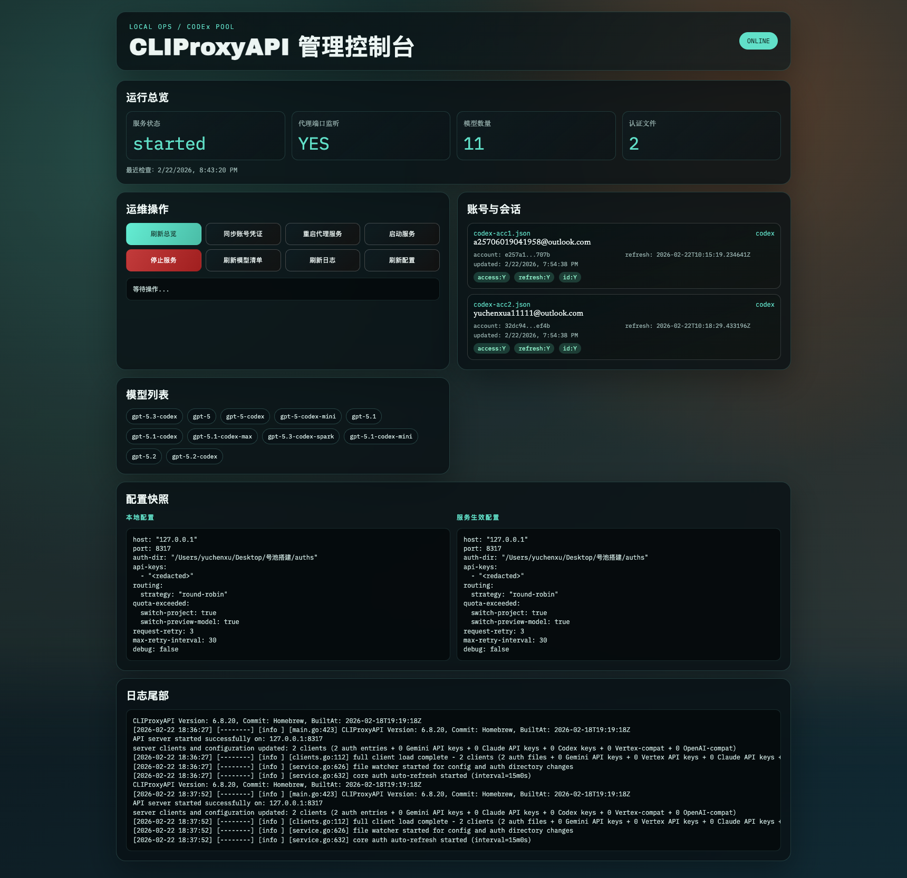
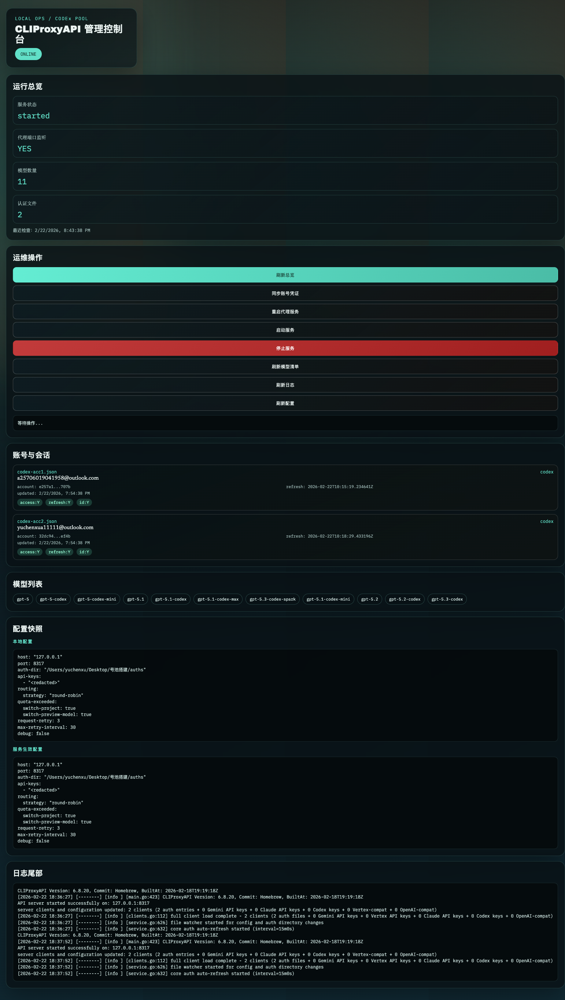
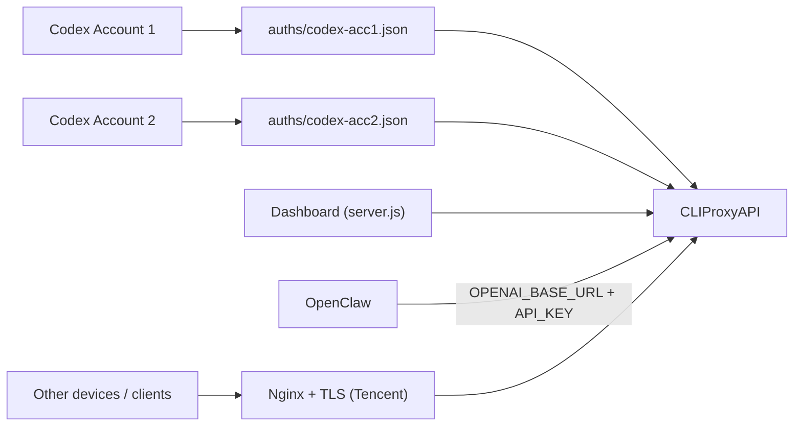

# CLIProxyAPI + OpenClaw 号池管理套件

把本地多 Codex 账号会话接入 `CLIProxyAPI`，并提供一个可视化控制台用于管理服务、账号会话、模型与日志。

本仓库已经包含两套可直接落地的一键部署方案：

- 本地一键部署（macOS/Linux 本机）
- 腾讯云一键部署（本地发起远程部署 + 服务器端安装）

## 截图

### 控制台（桌面）



### 控制台（移动端）



## 主要能力

- 双账号 Codex 会话同步：`sync_codex_auths.sh`
- CLIProxyAPI 本地代理管理
- Dashboard 可视化运维
- 配置与日志脱敏展示
- 一键部署脚本（本地 + 腾讯云）
- 常见故障复盘与标准修复路径

## 架构



## 仓库结构

- `server.js` Dashboard 后端 API
- `web/` Dashboard 前端
- `sync_codex_auths.sh` 从 `CODEX_HOME/auth.json` 转换认证文件
- `scripts/oneclick-local.sh` 本地一键部署
- `scripts/oneclick-tencent-remote.sh` 本地发起腾讯云远程部署
- `scripts/oneclick-tencent-server.sh` 腾讯云服务器端一键安装
- `config.example.yaml` CLIProxyAPI 示例配置
- `docs/oneclick-deploy.md` 部署与排障速查
- `skills/openclaw-telegram-bot-triage/SKILL.md` Telegram 机器人故障排障 Skill

## 环境要求

- `codex` CLI（已登录两个账号）
- `cliproxyapi` 二进制（本地或服务器可执行）
- `node >= 18`
- `npm`
- `jq`
- `curl`

腾讯云额外要求：

- Ubuntu 22.04+
- `systemd`
- 可选：`nginx`
- 可选：`certbot`（启用 TLS 时）

## 本地一键部署

### 1) 准备两个账号登录

```bash
CODEX_HOME=~/.codex-acc1 codex login
CODEX_HOME=~/.codex-acc2 codex login
```

### 2) 执行一键脚本

```bash
bash scripts/oneclick-local.sh
```

成功后默认地址：

- Dashboard：`http://127.0.0.1:8328`
- Proxy：`http://127.0.0.1:8317/v1`

### 3) 常用覆盖参数

```bash
CODEX_ACC1_HOME="$HOME/.codex-acc1" \
CODEX_ACC2_HOME="$HOME/.codex-acc2" \
CLIPROXY_PORT=18317 \
DASHBOARD_PORT=18328 \
CLIPROXY_API_KEY="replace-with-strong-key" \
bash scripts/oneclick-local.sh
```

## 腾讯云一键部署（推荐从本地发起）

### 本地发起远程部署

```bash
REMOTE_HOST="81.70.32.11" \
REMOTE_USER="ubuntu" \
SSH_KEY_PATH="$HOME/.ssh/id_rsa" \
DOMAIN="api.yuchenxu.cn" \
ENABLE_TLS=1 \
CERTBOT_EMAIL="you@example.com" \
bash scripts/oneclick-tencent-remote.sh
```

此流程会自动完成：

- 同步本地双账号 auth 文件
- 上传 `cliproxyapi-linux-amd64`
- 远端安装 systemd 服务 `cliproxyapi`
- 可选配置 `nginx` 反代和 TLS 证书

### 在服务器直接执行

```bash
CLIPROXY_API_KEY="replace-with-strong-key" \
CLIPROXY_PORT=15900 \
DOMAIN="api.your-domain.com" \
ENABLE_NGINX=1 \
ENABLE_TLS=1 \
CERTBOT_EMAIL="you@example.com" \
bash scripts/oneclick-tencent-server.sh
```

## OpenClaw 接入方式

将 OpenClaw 永久指向你的代理域名：

- `OPENAI_BASE_URL=https://api.your-domain.com/v1`
- `OPENAI_API_KEY=<cliproxy-api-key>`

示例验证：

```bash
openclaw models status --json --probe --probe-provider openai-codex --probe-model gpt-5.3-codex
```

## 在其他电脑使用 API

只要能访问你的域名 API，即可直接调用：

```bash
curl -sS https://api.your-domain.com/v1/models \
  -H "Authorization: Bearer <cliproxy-api-key>"
```

> 建议只开放 `443`，并让 `cliproxyapi` 仅监听 `127.0.0.1`。

## Dashboard API 清单

- `GET /api/health` 健康检查
- `GET /api/accounts` 已同步账号会话
- `GET /api/models` 模型列表
- `GET /api/config` 本地配置与生效配置（脱敏）
- `GET /api/logs?lines=180` 日志尾部
- `POST /api/actions/sync` 同步账号凭证
- `POST /api/actions/service` 管理服务（`start|stop|restart`）

`/api/actions/service` 请求示例：

```bash
curl -sS -X POST http://127.0.0.1:8328/api/actions/service \
  -H "Content-Type: application/json" \
  -d '{"action":"restart"}'
```

## 常见问题与修复

### 1) `getUpdates conflict (409)`

原因：同一个 Telegram bot token 被多个进程同时 long polling。

修复：只保留一个 polling 实例（统一主网关托管），停用重复 gateway。

### 2) `Missing config. Run clawdbot setup...`

原因：独立 bot 网关缺少 `clawdbot.json`。

修复：补配置或退回主网关统一托管。

### 3) `Invalid allowFrom/groupAllowFrom`

原因：使用了 Telegram 用户名而非数字 sender id。

修复：改为数字 ID，或删除非法项后重载。

## 安全建议

- 不要提交以下文件到 Git：
  - `auths/*.json`
  - `config.yaml`
  - `*.log`
  - `.env`
- 仅在服务端保存真实 API Key。
- 控制台展示与配置快照应保持脱敏。

## 版本信息

- 当前已验证：`cliproxyapi 6.8.20`
- 当前仓库提交：`e49507b`

## 相关文档

- 快速部署说明：`docs/oneclick-deploy.md`
- 域名化部署 runbook：`docs/openclaw-codex-cliproxy-rollout.md`
- Telegram 机器人排障 Skill：`skills/openclaw-telegram-bot-triage/SKILL.md`
